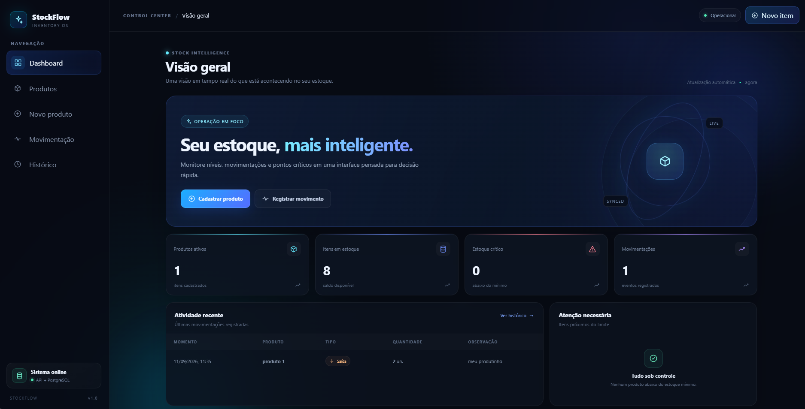

# 🚀 StockFlow

> Sistema web de controle e monitoramento de estoque, desenvolvido como Projeto de Extensão V do curso de Análise e Desenvolvimento de Sistemas.


---

## 📌 Sobre o projeto

O **StockFlow** é uma aplicação web desenvolvida para apoiar o controle de estoque de uma empresa do setor de peças automotivas.

O projeto surgiu a partir de necessidades identificadas durante as etapas anteriores do Projeto de Extensão, especialmente relacionadas a:

- controle manual de estoque;
- dificuldade de acompanhamento das entradas e saídas;
- ausência de uma visão centralizada dos produtos;
- dificuldade para identificar rapidamente itens próximos do estoque mínimo;
- necessidade de maior organização e rastreabilidade das movimentações.

A proposta do StockFlow é transformar esse processo em uma solução digital simples, funcional e de fácil utilização.

---

## 🎯 Objetivos

### Objetivo geral

Desenvolver uma solução web para auxiliar no controle e acompanhamento do estoque, proporcionando maior organização das informações e agilidade na consulta dos produtos e movimentações.

### Objetivos específicos

- Cadastrar e gerenciar produtos;
- Controlar entradas e saídas de estoque;
- Consultar o saldo atual dos produtos;
- Registrar o histórico de movimentações;
- Identificar produtos abaixo do estoque mínimo;
- Disponibilizar uma visão geral por meio de um dashboard;
- Validar preliminarmente a solução por meio de testes de utilização.

---

## ⚙️ Funcionalidades

### 📊 Dashboard

Visualização geral do estoque com indicadores como:

- quantidade de produtos cadastrados;
- itens disponíveis em estoque;
- quantidade de itens em situação crítica;
- número de movimentações registradas;
- atividade recente;
- produtos que necessitam de atenção.

### 📦 Produtos

- Cadastro de produtos;
- Consulta de produtos;
- Busca por nome ou SKU;
- Edição de informações;
- Exclusão de produtos;
- Visualização do status do estoque.

### 🔄 Movimentações

- Registro de entradas;
- Registro de saídas;
- Atualização automática do saldo;
- Inclusão de observações;
- Associação da movimentação ao produto.

### 🕒 Histórico

Registro das movimentações realizadas, permitindo acompanhar as operações de entrada e saída.

---

## 🧠 Regras de negócio

O sistema considera o estoque mínimo definido para cada produto.

Quando a quantidade disponível fica abaixo desse limite, o produto passa a ser identificado como **estoque crítico**, permitindo uma visualização mais rápida dos itens que necessitam de reposição.

As movimentações também atualizam o saldo do produto de acordo com o tipo de operação registrada:

- **Entrada:** aumenta a quantidade disponível;
- **Saída:** reduz a quantidade disponível.

---

## 🏗️ Arquitetura

O projeto utiliza uma arquitetura separando o frontend, backend e banco de dados.

```text
                    ┌─────────────────────┐
                    │      Frontend       │
                    │ React + TypeScript  │
                    └──────────┬──────────┘
                               │
                               │ HTTP / REST
                               ▼
                    ┌─────────────────────┐
                    │       Backend       │
                    │ NestJS + Node.js    │
                    └──────────┬──────────┘
                               │
                               │ Prisma ORM
                               ▼
                    ┌─────────────────────┐
                    │     PostgreSQL      │
                    │      Database       │
                    └─────────────────────┘
```

## 🖥️ Interface


